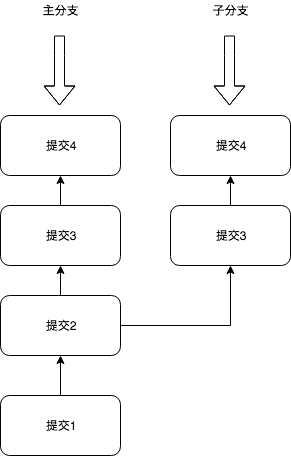
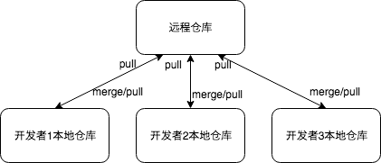
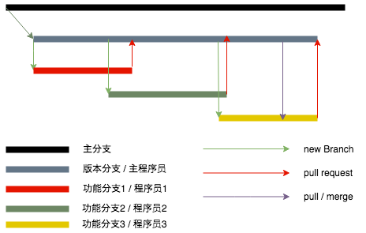
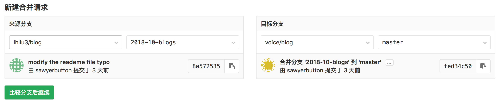
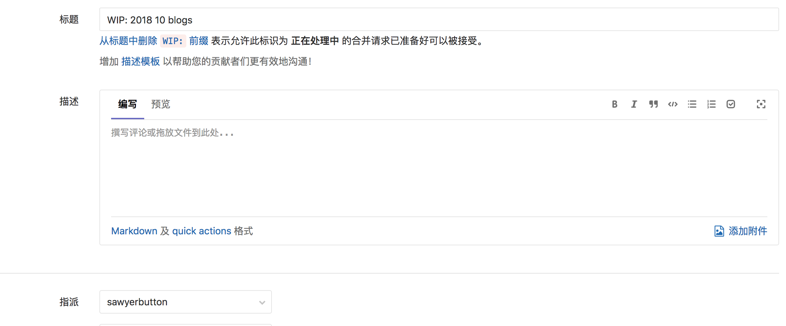

# Git_From_Intro_To_Jump-Out-Of_Pit

## Git从入门到跳坑

### Git是什么

- Git是一个开源的分布式版本管理系统

> 将这一描述拆分成不同的部分来看

- 控制系统

> 控制系统代表着Git是一个内容跟踪器。这意味着Git可以用来存储内容，而根据Git提供的其他功能来看，Git最常见的用途是存储代码

- 版本控制系统

> 存储在Git中代码将随着代码内容的增加而增加，不同的开发者可以并行地增加Git中的代码，而版本控制系统帮助去处理维护修改和变更的记录

- 分布式版本管理系统

> Git拥有一个存储在服务器上的远程仓库和一个存储在每个开发者机器上的的本地仓库。 这意味着代码并不仅仅存储在中央服务器中，完全的代码拷贝也存在于所有开发者的电脑中。 这也是为什么Git被称为`分布式`版本管理系统的原因

### 为什么Git是需要的

- 现实生活中项目通常有多个开发者并行开发，而Git这样的分布式版本管理工具可以保证在开发者之间没有存在代码冲突

- 除此之外，现实生活中需求的变化也是很正常的状况，版本控制系统允许开发者返回/`回退`到旧版本的代码中去

- 而有时几个并行运行的项目涉及相同的代码库，在这种情况下，Git中的`branch`将会大放异彩

### 如何使用Git

#### 下载Git

- [使用这个链接以获取多操作系统安装Git的教程](https://git-scm.com/book/en/v2/Getting-Started-Installing-Git)

> 安装完成后使用下述命令验证Git是否安装成功

```bash
git --version
```

#### 创造第一个本地Git仓库

- 在本地创建一个文件夹，比如`simple-git-repo`

- 进入文件夹中并初始化一个本地Git仓库，比如

```bash
cd simple-git-demo 
git init
```

- `git init`指令将会初始化出一个本地仓库

- 在本地创建一个`demo.ts`文件， 并向其中添加内容如`const demo = '我是Demo'`

> 创建什么类型的文件在此时并不重要，`ts`文件也可以被替换为`js`，`html`,`java`文件

#### 准备(staging)和提交(commiting)代码

- `staging`原本的含义是舞台，这里我意指为准备就绪

- 提交是将代码添加到本地仓库的的过程

- 在提交代码之前，需要将被提交的代码放置在准备区，而准备区是跟踪了所有需要被提交的代码的地方

- 任何不处于准备区的代码都不会被提交到本地代码库中。换言之这给与了开发者选择性提交内容的能力

> 放置`demo.ts`文件到准备区

```bash
git add demo.ts
```

> 假设你不仅仅有`demo.ts`文件也有其他一些文件`file1`,`file2`,`file3`, 而希望将他们都放置进准备区

```bash
git add file1 file2 file3
```

> 假设你希望将文件夹中所有的文件都放置进准备区(需要注意的是，他会将`所有`的`文件和文件夹`都放入准备区)

```bash
git add .
```

#### Git状态和Git记录

- 修改`demo.ts`文件并增加一行内容`const demo2 = '我是Demo2'`

```typescript
const demo = '我是Demo';
const demo2 = '我是Demo2';
```

> 使用`git status`可以观察到什么文件发生了变化以及在准备区的文件以及一些其他信息(之后再说)

```bash
git status
```

> 控制台将会展示`demo.ts`文件已经被修改但是并没有在准备区就绪

```bash
modified:   demo.ts
```

> 使用下述指令将`demo.ts`文件添加至准备区并提交他们

```bash
git add demo.ts
git commit -m "demo.ts file has been modified"
```

- 使用`log`指令可以打印出所有迄今为止的提交

```bash
git log
```

> 事实上，`log`将会显示每个提交的作者，提交的日期和相应的提交消息

#### Git分支

- 默认情况下，`git commit`将会作用于`master`分支，但是什么是`master`分支？

> 分支是指向Git仓库中最新提交的指针

> 换言之，上述操作中的主分支为指向了第二次提交`demo.ts`文件修改的指针

> 分支在多开发者平行开发时是不可或缺的



- 初始化时，提交1和提交2在主分支上完成，在提交2完成后创建了一个新的自分支，提交3和提交4同时分别在主分支和自分支上分别完成

- 主分支和子分支在提交2之后分道扬镳，两者分别拥有不同的代码

- 子分支可以通过`merge`命令合并到主分支中

##### 创建一个本地Git分支

- 使用如下命令创造一个`test`分支

```bash
git branch test
```

- 上述指令只是创造了新的`test`分支，此时我们仍然处在主分支中，通过`checkout`指令可以切换到`test`分支中

```bash
git checkout test
```

- 当需要查看所有的本地分支时可以使用如下指令

```bash
git branch
```

##### 在test分支上修改一些内容

- 在test分支上的`demo.ts`文件中增加内容`const demo3 = '我是test分支的demo'`

- 就绪并提交上述修改

```bash
git add demo.ts
git commit -m "test branch commit"
```

- 上述的提交在`test`分支上完成，现在`test`分支拥有两次提交，比主分支多一次提交，

- 值得记住的是,可以使用`git log`指令查看你在当前分支上的提交记录

#### 合并

- 经过上述的操作，`test`分支先于`master`分支一个提交，现在如果希望将`test`分支的代码带会`master`分支，`git merge`指令就可以大显神威

> 将`test`分支的内容合并到`master`分支中

```bash
git checkout master
git merge test
```

> 再执行上述操作后，如果两个分支之间没有冲突的话，分支的合并已经完成了

> 但是在真实的项目中，可能会存在代码冲突的问题，如何解决冲突？没有方法论，当你越来越多地使用git后，解决冲突将逐渐变得简单轻松

> 现在执行`git log`你会发现主分支现在也拥有了3个提交

### 远程Git仓库

- 迄今为止一直在对本地Git仓库进行处理，但是最终，这些本地仓库的代码将会上传到一个远程仓库中(Gihub,Gitee,Gitlab)

- 一旦代码上传到远程仓库，其他开发者就可以查看和修改这些代码



#### Github

- 作为世界上最大的代码库，作为开发者应当将Github当做自己的另一个本地仓库来维护

- 如何使用Github

1. 前往[Github官网]( https://github.com/)并注册账号
2. 注册成功后，点击`Start a Project`按钮以创建一个新的Git远程仓库
3. 进去仓库后会看到一个连接形如`https://github.com/your_name/your_repo.git`
4. 为了将本地仓库与远程仓库搭建起联系需要使用指令

```bash
git remote add origin [repository url]
```

5. 当本地仓库和远程的连接建立起来后，可以使用如下指令将本地仓库中代码推送到远程仓库中

```bash
git push -u origin master
```

> 这次推送(从含以上来说是上传)会将本地`master`分支上的代码上传到远程仓库中的`master`分支上

##### 一些简单的远程Git指令

- `git pull`指令将会拉取远程代码库中最新的代码到本地代码库中

- `git clone`指令用来复制一个既存的远程仓库到你的本地电脑中,这在尝试学习他人的代码和思路时非常有用

```bash
git clone [repository url]
```

### Git工作流程

- 当有多个开发人员共同参与项目时，正确地遵循Git的工作流程就变得十分重要了

- 假设现在有一个中型项目,一个比较合理的Git流程是



> 配合上述的流程讲述一个故事

- 你是公司的一个开发组长，公司需要你开发一个简化版的淘宝商城专门售卖公司产品

- 整个开发组有四名成员

1. 开发人员1: 一年开发经验
2. 开发人员2: 一年开发经验
3. 开发人员3: 三年开发经验
4. 你: 开发组长

#### 基于Git的开发流程

##### 主分支(Master Branch)

1. 主分支总是应当保持对产品代码的一份拷贝
2. 没有人能被允许直接对主分支进行代码的编写，主分支只应当作为产品代码的拷贝
3. 可以实际编写的代码应当位于其他分支

##### 发布型分支(Release Branch)

1. 当项目被创建的伊始创建一个发布型分支是很重要的，发布型分支创建于主分支
2. 所有和这个项目相关的代码都应该存在于发布型分支,发布型分支从创建操作上并没有什么区别，只是多了一个`release`前缀
3. 在同一代码库上有可能运行多个项目;因此，对于每个项目，都会创建一个单独的发布型分支.假设还有一个并行运行的项目,该项目有一个单独的发布型分支比如`release/project2`
4. 拥有发布型分支的原因是相同的代码库可以并行运行多个项目而项目之间不会存在冲突

##### 功能型分支(Feature Branch)

1. 每当一个新的功能在项目中被创建时都应当创建一个新的功能型分支, 这保证了每个功能都能被独立构建
2. 功能型分支本质上与其他分支无二，只是多了一个前缀`feature`
3. 现在，作为开发组长的你要求开发人员1开发一个登录功能，而这就应当创建一个新的功能型分支`feature/login`, 开发人员1对该功能编写的代码将全部保存于这个分支之中
4. 开发人员2得到一个任务构建一个用户购物车功能，所以他会创建一个新的功能型分支`feature/shoppingCart`
5. 开发人员3被要求开发一个客服与客户对话的功能，所以他需要创建一个功能型分支名为`feature/businessChat`
6. 当前，保证了所有开发者的代码都保存在了其自己创建的功能型分支之中
7. 过了一段时间，开发人员1完成了对于`login`功能的开发，他需要将他的代码从`feature/login`分支发送到`release/project1`分支上， 而这一过程可以通过`pull request`实现

##### Pull Request

- 首先值得注意的是，不要将`pull request`与`git pull`弄混淆了

- 开发人员1不被允许直接将`feature/login`分支的代码push到`release/project`分支上，作为开发组长的你应该在归并该功能前审核`feature/login`的代码，而这一过程则通过`pull request`实现

1. 开发人员1提起了一个`pull request`请求在GitLab上



2. 一旦上述完成，开发人员1需要输入`pull request`的标题和描述，最后点击`提交合并请求`，开发人员1还需要为此拉取请求分配审查人，由于你是开发组长，他将你标记为审查人



3. 开发组长将会审核`feature/login`的代码并在审核完成后将其代码合并到`release/project`分支

##### 代码冲突😠

1. 开发人员2也完成了他的功能部分，并且提起了一个`pull request`请求将`feature/shoppingCart`分支合并到`release/project`分支
2. 由于`release/project`分支已经具有`feature/login`代码，因此发生代码冲突,审查人有责任解决这些代码冲突并合并代码，在这种情况下，你作为开发组长需要解决这些代码冲突并合并代码
3. 开发人员3最后也完成了他的部分，作为一个有经验的开发者，他已经熟知如何处理代码冲突的问题. 他将最新的`release/project`通过`git pull`或者`git merge`合并到自己的分支`feature/businessChat`中并解决了出现的所有冲突，此时`feature/businessChat`分支也包含了`release/project`中的所有代码
4. 最后开发人员3提交了一个`pull request`, 因为冲突已经被提前处理掉了，可以直接将审核后`feature/businessChat`分支内容合并到`release/project`分支中

> 大致上有两种方式解决代码冲突

1. 审查`pull request`的审查人员处理冲突的代码
2. 开发人员确保将发布型分支中的最新代码合并到功能型分支中并自行解决冲突、

### 回归到主分支

- 项目完成后，发布型分支中的代码将会合并到主分支并将代码进行生产部署中

- 因此，生产部署中的代码和主分支中的代码始终保持同步，这也确保了对于任何未来的项目，主分支都能提供最新的代码